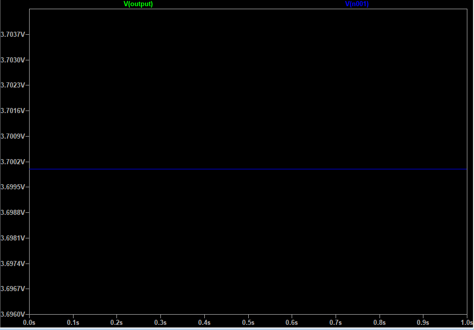

# SCH16T_Evt_Board

Murata製IMUであるSCH16Tシリーズの開発ボード

## システム構成図
本基板のシステム構成図を次に示す。

### 電源構成
USB-TypeCから5Vを給電でき、1SのLiPoバッテリを充電する機能を有する。
LiPoバッテリの充電中は、USBからの給電でマイコン及びIMUは駆動する。
LiPoバッテリが接続された状態でUSBを抜くと、LiPoバッテリからの給電に切り替わる。
5Vまたは3.7Vは低損失LDOによって3.3Vまで降圧される。

### 通信
マイコンとIMUはSPI通信で接続される。
また、マイコンからUSB-TypeCにはUSB通信で接続される。
マイコンにプログラムを書き込む場合は、USB-TypeCとPCを接続して行う。

## 1S LiPoバッテリの充電回路
先述した通り、USBコネクタを接続している間はLiPoバッテリが給電される。
回路動作の確認にはLTSpiceを用いて検証した。

USB接続時の波形は次の通りである。
USB VBATが5Vを給電している場合、OUTPUTは約5Vを出力しており、V(n001)は約3.7Vになっている。
なお、実回路状ではV(n001)はLiPoバッテリの充電状況で変動する。
今回使用するバッテリ充電IC”MCP73831”の最大充電電圧は4.2Vである。

LiPoバッテリ接続時(USBコネクタ非接続)の波形は次の通りである。
OUTPUTは約3.7Vを出力しており、V(n001)は約3.7Vになっている。

## IMU周辺回路
IMUであるMurata製SCH16Tシリーズの周辺回路は、公式サイトのアプリケーションノート(SCH16T series chip carrier PCB spesification)に従う。
>https://www.murata.com/-/media/webrenewal/products/sensor/pdf/specification/sch16t-pcb-specification.ashx?la=ja-jp&cvid=20240628010000000000

## 回路図
全体回路図を次に示す。
画像が見ずらい場合は、「sch16t_evt/schematic」内のPDFを参照のこと。

## ピンレイアウト
ピンアウトを下記の表に示す。
なお、ピン番号:5の+5Vは給電用であり、LiPoバッテリが接続されていても充電はされない。LiPoバッテリの接続中にピン番号:5への給電は非推奨。

| ピン番号 | ピンアサイン |
| ---- | ---- |
| 1 | ESP32 UART RX1(RXD0) |
| 2 | ESP32 UART TX1(TXD0) |
| 3 | PPS(IO14) |
| 4 | ESP32 GPIO(IO15) |
| 5 | +5V |
| 6 | GND |
| 7 | ESP32 UART TX2(IO5) |
| 8 | ESP32 UART RX2(IO4) |

## 発注する場合
基板の製造および、部品実装に必要なデータは「sch16t_evt/SCH16T_evt_board_ver_1_1」に保存されている。
JLCPCBのみ対応しており、SCH16Tだけは現状自分で用意する必要がある。
それ以外の部品は、JLCPCBAに対応する(2025年4月時点)。

## KiCadライブラリ
本開発ボードではKiCadの既存ライブラリに加えて、SCH16XXとESP32-C6-MINI-1-N4を使用しています。
KiCadファイルを編集する際は、各自でライブラリを適用してください。

### SCH16XX
自作です、じゆうにつかっていいよ(一応、MITライセンスに従います)。

>MIT License
>
>Copyright (c) [2024] [Mint9821]
>
>Permission is hereby granted, free of charge, to any person obtaining a copy
of this library and associated files, to deal in the library without restriction, including without limitation the rights to use, copy, modify, merge, publish, distribute, sublicense, and/or sell copies of the library...

### ESP32-C6-MINI-1-N4
公開されているライブラリを使用。
KiCadの回路図およびPCBを開く際は下記URLからライブラリをダウンロードした後に適用してください。

>https://www.snapeda.com/parts/ESP32-C6-MINI-1-N4/Espressif%20Systems/view-part/

>このリポジトリには、SnapMagic Search, Inc. が提供するモデルを含んでいます。
モデルの使用にあたっては、[SnapMagic Model License](URL) に従ってください。
モデル単体での再配布は禁止されています。

### その他ライブラリ

>本設計はKiCad公式ライブラリを使用しています。
ライブラリはCC BY-SA 4.0のライセンスの下に配布されています。
https://creativecommons.org/licenses/by-sa/4.0/
